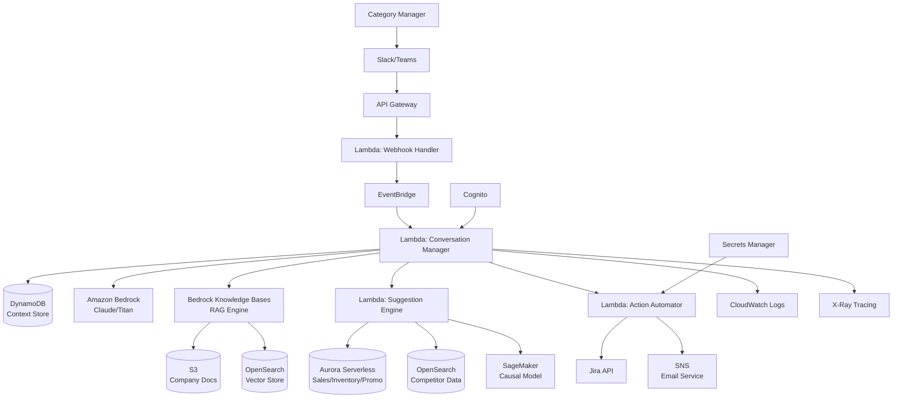
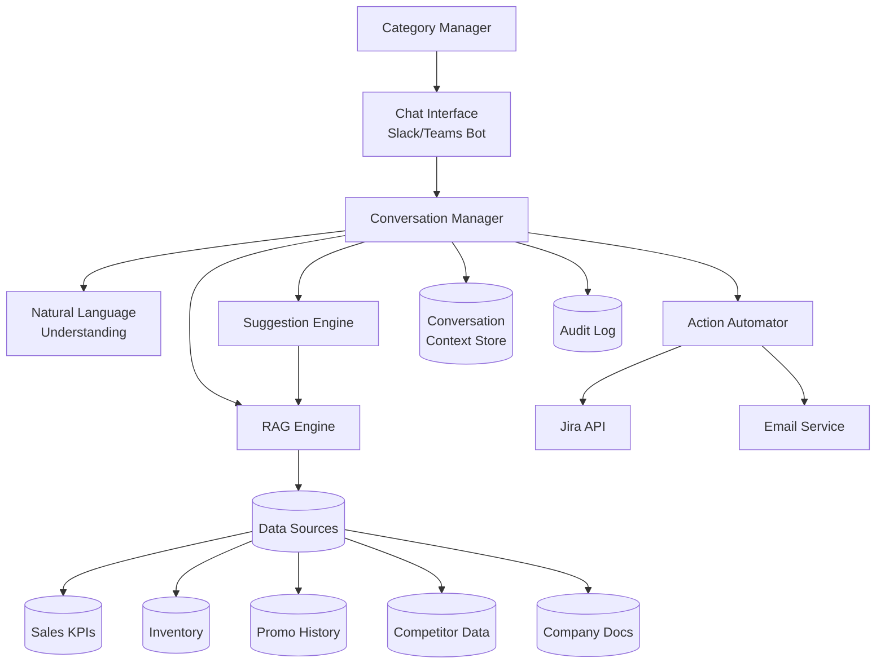

# Design Document: Category Manager Copilot

## Overview

The Category Manager Copilot is a conversational AI system that helps retail category managers make data-driven decisions through natural language interaction. The system integrates multiple data sources (sales KPIs, inventory, promo history, competitor activity), uses retrieval-augmented generation (RAG) to provide contextual insights, and automates action creation in external systems.

The architecture follows a modular design with clear separation between:
- **Chat Interface Layer**: Handles Slack/Teams integration and message routing
- **Conversation Management**: Maintains context and orchestrates query processing
- **RAG Engine**: Retrieves and synthesizes information from multiple data sources
- **Suggestion Engine**: Generates causal recommendations based on data analysis
- **Action Automation**: Creates tasks and sends notifications in external systems

This design prioritizes extensibility (easy to add new data sources or actions), reliability (graceful degradation when services fail), and user experience (fast responses with clear citations).

## Technology Stack

This solution leverages AWS services to build a scalable, serverless conversational AI platform optimized for the AWS ecosystem.

### Core AWS Services

**Compute & Orchestration**
- **AWS Lambda**: Serverless compute for all backend logic (conversation management, NLU, RAG, action automation)
- **Amazon API Gateway**: REST API endpoints for Slack/Teams webhooks
- **AWS Step Functions**: Orchestration for multi-step workflows (complex queries, action automation)

**AI & Machine Learning**
- **Amazon Bedrock**: Foundation models for natural language understanding and generation (Claude, Titan)
- **Amazon Bedrock Knowledge Bases**: RAG implementation with vector storage and semantic search
- **Amazon SageMaker**: Custom model hosting for the causal suggestion engine
- **Amazon Comprehend**: Entity extraction and sentiment analysis for query parsing

**Data Storage & Management**
- **Amazon DynamoDB**: Conversation context storage, user sessions, audit logs
- **Amazon S3**: Company document storage, training data, model artifacts
- **Amazon RDS (Aurora Serverless)**: Structured data storage for sales KPIs, inventory, promo history
- **Amazon OpenSearch Service**: Full-text search and analytics for competitor data

**Integration & Messaging**
- **Amazon EventBridge**: Event-driven architecture for asynchronous processing
- **Amazon SQS**: Message queuing for handling high-load scenarios
- **Amazon SNS**: Notifications and email delivery
- **AWS AppSync**: GraphQL API for real-time updates (optional)

**Security & Authentication**
- **Amazon Cognito**: User authentication and authorization
- **AWS Secrets Manager**: Secure storage for API keys (Slack, Teams, Jira)
- **AWS IAM**: Fine-grained access control for data sources
- **AWS KMS**: Encryption for sensitive data at rest and in transit

**Monitoring & Observability**
- **Amazon CloudWatch**: Logging, metrics, and alarms
- **AWS X-Ray**: Distributed tracing for debugging
- **Amazon CloudWatch Logs Insights**: Log analysis and querying

**Developer Tools**
- **AWS CDK**: Infrastructure as Code for deployment
- **AWS CodePipeline**: CI/CD automation
- **AWS CodeBuild**: Build and test automation

### Architecture Diagram with AWS Services



### Technology Choices Rationale

**Amazon Bedrock for LLM**
- Fully managed foundation models (no infrastructure management)
- Built-in RAG capabilities through Knowledge Bases
- Support for multiple models (Claude for reasoning, Titan for embeddings)
- Pay-per-use pricing ideal for MVP
- Enterprise-grade security and compliance

**DynamoDB for Context Storage**
- Single-digit millisecond latency for conversation retrieval
- Automatic scaling for concurrent users
- TTL support for automatic session cleanup
- Serverless (no capacity planning)

**Aurora Serverless for Structured Data**
- Auto-scaling based on query load
- PostgreSQL compatibility for complex analytical queries
- Pause/resume capability for cost optimization
- Suitable for sales KPIs, inventory, promo history

**Lambda for Compute**
- Event-driven architecture matches conversational flow
- Automatic scaling to 50+ concurrent users
- Pay only for actual compute time
- Easy integration with all AWS services

**Step Functions for Complex Workflows**
- Visual workflow orchestration
- Built-in error handling and retry logic
- Ideal for multi-step processes (data retrieval → analysis → action creation)
- Audit trail of execution history

**OpenSearch for Competitor Data**
- Real-time search and analytics
- Time-series data handling for price tracking
- Aggregations for trend analysis
- Scalable for large datasets

### Deployment Architecture

**Multi-Region Setup** (for production)
- Primary region: us-east-1
- Failover region: us-west-2
- Route 53 for DNS and health checks
- Cross-region DynamoDB replication

**Environment Separation**
- Development: Single region, minimal resources
- Staging: Production-like, reduced capacity
- Production: Multi-region, auto-scaling enabled

**Cost Optimization**
- Lambda provisioned concurrency for warm starts (production only)
- Aurora Serverless v2 with auto-pause
- S3 Intelligent-Tiering for document storage
- CloudWatch Logs retention policies (7 days dev, 30 days prod)

## Architecture

### High-Level Architecture



### Component Responsibilities

**Chat Interface (Slack/Teams Bot) - API Gateway + Lambda**
- API Gateway receives webhook POST requests from Slack/Teams
- Lambda function validates webhook signatures
- Routes messages to EventBridge for async processing
- Formats and sends responses back via Slack/Teams APIs
- Retrieves bot tokens from AWS Secrets Manager

**Conversation Manager - Lambda + Step Functions**
- Lambda function orchestrates the query processing pipeline
- Step Functions coordinate multi-step workflows
- Retrieves conversation context from DynamoDB
- Determines which components to invoke based on query type
- Aggregates results and formats final responses
- Manages error handling and graceful degradation
- Publishes metrics to CloudWatch

**Natural Language Understanding (NLU) - Amazon Bedrock + Comprehend**
- Amazon Bedrock (Claude) parses queries to extract intent
- Amazon Comprehend extracts named entities (SKUs, stores, dates)
- Lambda function identifies query type and filters
- Detects ambiguity using confidence scores
- Generates clarifying questions via Bedrock

**RAG Engine - Amazon Bedrock Knowledge Bases**
- Bedrock Knowledge Bases for semantic search over company docs
- S3 stores source documents
- OpenSearch Service provides vector storage
- Lambda functions query Aurora for structured data (KPIs)
- Combines document chunks with database results
- Provides citations with S3 URIs and database timestamps
- ElastiCache (optional) for caching frequent queries

**Suggestion Engine - Lambda + SageMaker**
- Lambda function generates recommendations
- SageMaker endpoint hosts custom causal reasoning model
- Applies business rules and ranking algorithms
- Queries Aurora for historical data (sales, promos)
- Calculates expected impact using statistical models
- Returns ranked recommendations with confidence scores

**Action Automator - Lambda + SNS**
- Lambda function creates Jira tasks via REST API
- SNS sends formatted emails
- Retrieves API credentials from Secrets Manager
- Implements retry logic with exponential backoff
- Publishes success/failure events to EventBridge
- Stores action outcomes in DynamoDB

**Context Store - DynamoDB**
- Stores conversation history per user/session
- Partition key: userId, Sort key: sessionId
- TTL attribute for automatic session cleanup (24 hours)
- Global Secondary Index on sessionId for quick lookups
- Point-in-time recovery enabled for data protection

**Audit Log - CloudWatch Logs + DynamoDB**
- CloudWatch Logs captures all Lambda execution logs
- DynamoDB table stores structured audit records
- Records user interactions, recommendations, actions
- Tracks feedback and action outcomes
- Enables compliance reporting and model improvement analysis

## Components and Interfaces

### Chat Interface

**Slack Bot Interface**
```typescript
interface SlackBotInterface {
  // Receives incoming messages from Slack
  handleSlackMessage(event: SlackMessageEvent): Promise<void>
  
  // Sends response back to Slack
  sendSlackResponse(channel: string, thread: string, message: FormattedMessage): Promise<void>
  
  // Verifies Slack webhook signatures
  verifySlackSignature(request: HttpRequest): boolean
}

interface SlackMessageEvent {
  channel: string
  user: string
  text: string
  thread_ts?: string
  timestamp: string
}
```

**Teams Bot Interface**
```typescript
interface TeamsBotInterface {
  // Receives incoming messages from Teams
  handleTeamsMessage(activity: TeamsActivity): Promise<void>
  
  // Sends response back to Teams
  sendTeamsResponse(conversation: ConversationReference, message: FormattedMessage): Promise<void>
  
  // Handles Teams authentication
  authenticateTeamsRequest(request: HttpRequest): Promise<boolean>
}

interface TeamsActivity {
  conversationId: string
  userId: string
  text: string
  timestamp: string
}
```

### Conversation Manager

```typescript
interface ConversationManager {
  // Main entry point for processing user queries
  processQuery(userId: string, query: string, context: ConversationContext): Promise<Response>
  
  // Retrieves conversation history
  getConversationHistory(userId: string, sessionId: string): Promise<ConversationContext>
  
  // Updates conversation context
  updateContext(userId: string, sessionId: string, newContext: ConversationContext): Promise<void>
  
  // Handles feedback on responses
  recordFeedback(userId: string, responseId: string, feedback: Feedback): Promise<void>
}

interface ConversationContext {
  sessionId: string
  userId: string
  messageHistory: Message[]
  currentTopic?: string
  referencedEntities: Map<string, Entity>
  lastQueryTime: Date
}

interface Message {
  role: 'user' | 'assistant'
  content: string
  timestamp: Date
  metadata?: Record<string, any>
}

interface Response {
  text: string
  citations: Citation[]
  actions: Action[]
  confidence: number
  responseId: string
}
```

### Natural Language Understanding

```typescript
interface NLUService {
  // Parses query to extract intent and entities
  parseQuery(query: string, context: ConversationContext): Promise<ParsedQuery>
  
  // Detects if query is ambiguous
  detectAmbiguity(query: string): Promise<AmbiguityResult>
  
  // Generates clarifying questions
  generateClarifyingQuestions(ambiguity: AmbiguityResult): Promise<string[]>
}

interface ParsedQuery {
  intent: QueryIntent
  entities: Entity[]
  filters: QueryFilter[]
  timeRange?: TimeRange
  confidence: number
}

type QueryIntent = 
  | 'markdown_recommendation'
  | 'promo_analysis'
  | 'assortment_optimization'
  | 'general_question'
  | 'action_request'

interface Entity {
  type: 'sku' | 'category' | 'store' | 'region' | 'time_period'
  value: string
  normalizedValue: string
}

interface QueryFilter {
  field: string
  operator: 'equals' | 'greater_than' | 'less_than' | 'in'
  value: any
}
```

### RAG Engine

```typescript
interface RAGEngine {
  // Retrieves relevant information from all data sources
  retrieve(query: ParsedQuery, context: ConversationContext): Promise<RetrievalResult>
  
  // Searches company documents semantically
  searchDocuments(query: string, topK: number): Promise<DocumentChunk[]>
  
  // Queries structured data sources
  queryDataSource(source: DataSource, filters: QueryFilter[]): Promise<DataResult>
  
  // Combines results from multiple sources
  synthesizeResults(results: RetrievalResult[]): Promise<SynthesizedData>
}

interface RetrievalResult {
  source: DataSource
  data: any
  citations: Citation[]
  timestamp: Date
  confidence: number
}

interface Citation {
  source: string
  sourceType: 'document' | 'database' | 'api'
  reference: string
  timestamp?: Date
  excerpt?: string
}

interface DocumentChunk {
  documentId: string
  documentName: string
  chunkText: string
  relevanceScore: number
  metadata: Record<string, any>
}

type DataSource = 'sales_kpis' | 'inventory' | 'promo_history' | 'competitor_activity' | 'company_docs'

interface DataResult {
  source: DataSource
  records: Record<string, any>[]
  metadata: {
    queryTime: Date
    recordCount: number
    filters: QueryFilter[]
  }
}
```

### Suggestion Engine

```typescript
interface SuggestionEngine {
  // Generates markdown recommendations
  generateMarkdownRecommendations(data: SynthesizedData, filters: QueryFilter[]): Promise<MarkdownRecommendation[]>
  
  // Analyzes promotional effectiveness
  analyzePromoPerformance(data: SynthesizedData, filters: QueryFilter[]): Promise<PromoAnalysis>
  
  // Provides assortment optimization suggestions
  optimizeAssortment(data: SynthesizedData, filters: QueryFilter[]): Promise<AssortmentRecommendation[]>
  
  // Calculates expected impact of recommendations
  calculateImpact(recommendation: Recommendation): Promise<ImpactEstimate>
}

interface MarkdownRecommendation {
  sku: string
  skuName: string
  currentPrice: number
  recommendedPrice: number
  discountPercent: number
  rationale: string
  expectedImpact: ImpactEstimate
  urgency: 'high' | 'medium' | 'low'
  rank: number
}

interface PromoAnalysis {
  summary: string
  topPerformingPromos: PromoPerformance[]
  recommendations: string[]
  cannibalizationRisks: CannibalizationWarning[]
}

interface PromoPerformance {
  promoId: string
  promoName: string
  category: string
  liftPercent: number
  roi: number
  timeframe: TimeRange
}

interface AssortmentRecommendation {
  action: 'add' | 'remove' | 'expand'
  sku?: string
  category: string
  rationale: string
  expectedImpact: ImpactEstimate
  rank: number
}

interface ImpactEstimate {
  revenueImpact: number
  marginImpact: number
  inventoryImpact: number
  confidence: number
}

interface Recommendation {
  type: 'markdown' | 'promo' | 'assortment'
  data: any
  rationale: string
  confidence: number
}
```

### Action Automator

```typescript
interface ActionAutomator {
  // Creates a task in Jira
  createJiraTask(task: TaskDefinition): Promise<TaskResult>
  
  // Sends an email with recommendations
  sendEmail(email: EmailDefinition): Promise<EmailResult>
  
  // Validates action is authorized for user
  validateAction(userId: string, action: Action): Promise<boolean>
}

interface TaskDefinition {
  title: string
  description: string
  project: string
  issueType: string
  assignee?: string
  priority: 'high' | 'medium' | 'low'
  labels: string[]
  customFields: Record<string, any>
}

interface TaskResult {
  success: boolean
  taskId?: string
  taskUrl?: string
  error?: string
}

interface EmailDefinition {
  recipients: string[]
  subject: string
  body: string
  attachments?: Attachment[]
  format: 'html' | 'plain'
}

interface EmailResult {
  success: boolean
  messageId?: string
  error?: string
}

interface Action {
  type: 'create_task' | 'send_email'
  label: string
  data: TaskDefinition | EmailDefinition
}
```

### Authentication and Authorization

```typescript
interface AuthService {
  // Verifies user is authenticated
  authenticateUser(userId: string, platform: 'slack' | 'teams'): Promise<AuthResult>
  
  // Checks if user has access to copilot
  authorizeUser(userId: string): Promise<boolean>
  
  // Checks data access permissions
  checkDataAccess(userId: string, dataSource: DataSource): Promise<boolean>
  
  // Logs user interaction for audit
  logInteraction(userId: string, query: string, response: Response): Promise<void>
}

interface AuthResult {
  authenticated: boolean
  userId: string
  userName: string
  roles: string[]
  permissions: string[]
}
```

## Data Models

### Core Domain Models

```typescript
// SKU and Product Information
interface SKU {
  skuId: string
  skuName: string
  category: string
  subcategory: string
  currentPrice: number
  cost: number
  margin: number
  supplier: string
}

// Sales Performance
interface SalesData {
  skuId: string
  storeId?: string
  region?: string
  date: Date
  unitsSold: number
  revenue: number
  margin: number
}

// Inventory Levels
interface InventoryData {
  skuId: string
  storeId: string
  quantityOnHand: number
  quantityOnOrder: number
  daysOfSupply: number
  lastRestockDate: Date
}

// Promotional History
interface PromoData {
  promoId: string
  promoName: string
  skuIds: string[]
  category: string
  startDate: Date
  endDate: Date
  discountPercent: number
  liftPercent?: number
  roi?: number
}

// Competitor Activity
interface CompetitorData {
  competitorId: string
  competitorName: string
  skuId?: string
  category?: string
  observedPrice: number
  observedDate: Date
  promoActive: boolean
}

// Store and Location
interface Store {
  storeId: string
  storeName: string
  region: string
  format: string
  squareFootage: number
}

// Time Range
interface TimeRange {
  start: Date
  end: Date
}
```

### Conversation Models

```typescript
// Stored conversation context
interface StoredContext {
  sessionId: string
  userId: string
  platform: 'slack' | 'teams'
  channelId: string
  threadId?: string
  messages: StoredMessage[]
  entities: Map<string, Entity>
  createdAt: Date
  lastActivityAt: Date
  expiresAt: Date
}

interface StoredMessage {
  messageId: string
  role: 'user' | 'assistant'
  content: string
  timestamp: Date
  metadata?: {
    intent?: QueryIntent
    citations?: Citation[]
    actions?: Action[]
    feedback?: Feedback
  }
}

interface Feedback {
  rating: 'helpful' | 'not_helpful'
  comment?: string
  timestamp: Date
}
```

### Configuration Models

```typescript
// System configuration
interface CopilotConfig {
  platforms: PlatformConfig[]
  dataSources: DataSourceConfig[]
  llmConfig: LLMConfig
  actionConfig: ActionConfig
  performanceConfig: PerformanceConfig
}

interface PlatformConfig {
  platform: 'slack' | 'teams'
  enabled: boolean
  botToken: string
  signingSecret: string
  webhookUrl: string
}

interface DataSourceConfig {
  source: DataSource
  enabled: boolean
  connectionString: string
  refreshInterval: number
  timeout: number
}

interface LLMConfig {
  provider: string
  model: string
  temperature: number
  maxTokens: number
  embeddingModel: string
}

interface ActionConfig {
  jiraEnabled: boolean
  jiraUrl: string
  jiraProject: string
  emailEnabled: boolean
  emailProvider: string
}

interface PerformanceConfig {
  maxConcurrentUsers: number
  queryTimeout: number
  cacheEnabled: boolean
  cacheTTL: number
}
```


## Correctness Properties

A property is a characteristic or behavior that should hold true across all valid executions of a system—essentially, a formal statement about what the system should do. Properties serve as the bridge between human-readable specifications and machine-verifiable correctness guarantees.

### Property 1: Query Parsing Completeness
*For any* natural language query sent by a Category Manager, the NLU service should successfully parse it and return a ParsedQuery object without throwing exceptions.
**Validates: Requirements 1.1**

### Property 2: Multi-Source Data Retrieval
*For any* query requiring data, the RAG Engine should attempt to retrieve information from all relevant data sources (sales KPIs, inventory, promo history, competitor activity) based on the query intent.
**Validates: Requirements 2.1, 2.3**

### Property 3: Citation Completeness
*For any* response that includes data or document references, the response should include complete citations with source type, reference identifier, and timestamp (when applicable).
**Validates: Requirements 2.2, 11.1, 11.3**

### Property 4: Recommendation Rationale Inclusion
*For any* recommendation (markdown, promo, or assortment), the recommendation should include a rationale field that references the data sources and reasoning behind the suggestion.
**Validates: Requirements 2.5, 3.2**

### Property 5: Markdown Ranking Consistency
*For any* markdown recommendation query, the returned list of SKU recommendations should be ranked in descending order by a consistent scoring metric (expected impact or urgency).
**Validates: Requirements 3.1**

### Property 6: Impact Calculation Presence
*For any* markdown recommendation, the recommendation should include a calculated ImpactEstimate with revenue, margin, and inventory impact values.
**Validates: Requirements 3.3**

### Property 7: Location Filter Application
*For any* query that specifies store-level or region-level filters, all returned recommendations should match the specified location constraints.
**Validates: Requirements 3.5, 6.5**

### Property 8: Action Options Availability
*For any* recommendation provided to a user, the response should include at least one actionable option (create task, send email, or provide feedback).
**Validates: Requirements 4.1, 14.1**

### Property 9: Task Creation Success
*For any* approved action request to create a Jira task, the Action Automator should either successfully create the task and return a task URL, or fail gracefully with error details.
**Validates: Requirements 4.2**

### Property 10: Task Context Population
*For any* successfully created Jira task, the task description should include relevant context from the conversation (query, recommendation, rationale).
**Validates: Requirements 4.3**

### Property 11: Task Confirmation Delivery
*For any* successful task creation, the Copilot should send a confirmation message to the user that includes the task ID and a clickable link.
**Validates: Requirements 4.4**

### Property 12: Historical Promo Data Retrieval
*For any* query about promotional performance, the RAG Engine should retrieve historical promo data covering at least the requested time period.
**Validates: Requirements 5.1**

### Property 13: Promo Reference Inclusion
*For any* promotional strategy suggestion, the suggestion should reference at least one similar past promotion with its outcome metrics.
**Validates: Requirements 5.3**

### Property 14: Promotional Sensitivity Ranking
*For any* query about promotional sensitivity, the returned products or categories should be ranked by their promotional lift percentage or ROI.
**Validates: Requirements 5.4**

### Property 15: Sales Analysis Execution
*For any* assortment query, the Suggestion Engine should analyze sales performance data (units sold, revenue, margin) for the relevant SKUs.
**Validates: Requirements 6.1**

### Property 16: Underperformer Identification Criteria
*For any* SKU identified as underperforming, the SKU should meet at least one objective criterion (low sales velocity, negative margin, high inventory age).
**Validates: Requirements 6.2**

### Property 17: Assortment Factor Consideration
*For any* assortment recommendation, the recommendation rationale should reference both inventory turnover and margin contribution metrics.
**Validates: Requirements 6.4**

### Property 18: Conversation Context Preservation
*For any* follow-up query within a session, the Conversation Manager should have access to all previous messages and extracted entities from the current session.
**Validates: Requirements 7.1, 7.4**

### Property 19: Platform Thread Preservation
*For any* message received via Slack or Teams, the response should be sent to the same thread or conversation ID as the original message.
**Validates: Requirements 8.3, 8.4**

### Property 20: Email Generation Completeness
*For any* email summary request, the generated email should include conversation highlights, recommendations, and proper formatting (subject, body, recipients).
**Validates: Requirements 9.1, 9.2, 9.3**

### Property 21: Access Control Enforcement
*For any* user interaction, the system should verify authentication, check authorization against seat licenses, and enforce data access controls based on user permissions before processing the request.
**Validates: Requirements 10.1, 10.2, 10.4**

### Property 22: Audit Logging Completeness
*For any* user interaction or system error, the system should create an audit log entry with user ID, timestamp, query/action, and outcome.
**Validates: Requirements 10.5, 13.4**

### Property 23: Time-Sensitive Data Timestamps
*For any* response that includes time-sensitive data (sales figures, inventory levels, competitor prices), each data point should include a timestamp indicating when the data was captured.
**Validates: Requirements 11.2**

### Property 24: Fact vs. Suggestion Distinction
*For any* response containing both factual data and AI-generated suggestions, the response should clearly distinguish between the two (e.g., through formatting, labels, or separate sections).
**Validates: Requirements 11.4**

### Property 25: Feedback Collection and Tracking
*For any* user feedback submission, the system should store the feedback with associated metadata (response ID, rating, comment, timestamp) and track which recommendations led to actions.
**Validates: Requirements 14.2, 14.4, 14.5**

## Error Handling

The system implements comprehensive error handling with graceful degradation:

### Data Source Failures
- **Partial Availability**: When one or more data sources are unavailable, the RAG Engine continues with available sources and informs the user which sources are missing
- **Complete Failure**: When all data sources are unavailable, the system provides a clear error message and suggests trying again later
- **Timeout Handling**: Data source queries have configurable timeouts; slow sources are skipped with user notification

### RAG Engine Failures
- **Retrieval Errors**: When document retrieval fails, the system falls back to structured data sources only
- **Embedding Errors**: When semantic search fails, the system uses keyword-based search as fallback
- **Synthesis Errors**: When result synthesis fails, the system returns raw data with minimal formatting

### Action Automation Failures
- **Jira API Errors**: When task creation fails, the system provides formatted task details for manual creation
- **Email Errors**: When email sending fails, the system displays the email content and suggests copying it manually
- **Authentication Errors**: When external service authentication fails, the system provides re-authentication instructions

### LLM and NLU Failures
- **Parsing Errors**: When query parsing fails, the system asks clarifying questions or provides example queries
- **Generation Errors**: When response generation fails, the system returns structured data without natural language formatting
- **Timeout Errors**: When LLM calls timeout, the system provides a simplified response based on cached data

### Conversation State Errors
- **Context Loss**: When conversation context is lost, the system asks the user to restate their question with full context
- **Session Expiry**: When sessions expire, the system notifies the user and starts a fresh session
- **Concurrent Modification**: When multiple requests modify the same session, the system uses optimistic locking with retry

### Error Response Format
All error responses follow a consistent format:
```typescript
interface ErrorResponse {
  success: false
  errorType: 'data_source' | 'rag' | 'action' | 'llm' | 'auth' | 'unknown'
  userMessage: string
  technicalDetails?: string
  suggestedActions: string[]
  retryable: boolean
}
```

### Retry Logic
- **Transient Failures**: Automatically retry up to 3 times with exponential backoff
- **Rate Limiting**: Implement circuit breaker pattern to prevent cascading failures
- **User Notification**: Inform users when retries are in progress for operations taking >3 seconds

## Testing Strategy

The testing strategy employs a dual approach combining unit tests for specific scenarios and property-based tests for universal correctness guarantees.

### Property-Based Testing

Property-based testing validates that universal properties hold across many generated inputs. We will use **fast-check** (for TypeScript/JavaScript) as the property-based testing library.

**Configuration**:
- Minimum 100 iterations per property test
- Each test tagged with format: `Feature: category-manager-copilot, Property {N}: {property_text}`
- Tests run as part of CI/CD pipeline

**Property Test Coverage**:
Each of the 25 correctness properties listed above will be implemented as a property-based test. The tests will:
- Generate random valid inputs (queries, user contexts, data sources)
- Execute the system behavior
- Assert the property holds for all generated inputs
- Report counterexamples when properties fail

**Example Property Test Structure**:
```typescript
// Feature: category-manager-copilot, Property 1: Query Parsing Completeness
test('NLU parses all natural language queries without exceptions', async () => {
  await fc.assert(
    fc.asyncProperty(
      fc.string({ minLength: 5, maxLength: 200 }), // Generate random queries
      async (query) => {
        const nlu = new NLUService();
        const context = createEmptyContext();
        
        // Should not throw exception
        const result = await nlu.parseQuery(query, context);
        
        // Should return valid ParsedQuery
        expect(result).toBeDefined();
        expect(result.intent).toBeDefined();
        expect(result.entities).toBeInstanceOf(Array);
        expect(result.confidence).toBeGreaterThanOrEqual(0);
        expect(result.confidence).toBeLessThanOrEqual(1);
      }
    ),
    { numRuns: 100 }
  );
});
```

### Unit Testing

Unit tests complement property tests by validating specific examples, edge cases, and error conditions.

**Focus Areas**:
- **Specific Examples**: Test concrete scenarios mentioned in requirements (e.g., "Which SKUs should be marked down this weekend?")
- **Edge Cases**: Empty inputs, boundary values, special characters, very long inputs
- **Error Conditions**: Invalid authentication, missing data, malformed responses
- **Integration Points**: Slack/Teams webhook handling, Jira API calls, email sending
- **Ambiguity Handling**: Specific ambiguous queries that should trigger clarification
- **Platform-Specific Behavior**: Slack thread handling, Teams conversation routing

**Example Unit Test**:
```typescript
describe('Markdown Recommendations', () => {
  test('handles empty inventory gracefully', async () => {
    const engine = new SuggestionEngine();
    const data = createSynthesizedData({ inventory: [] });
    
    const recommendations = await engine.generateMarkdownRecommendations(data, []);
    
    expect(recommendations).toEqual([]);
  });
  
  test('returns specific example query correctly', async () => {
    const copilot = new ConversationManager();
    const query = "Which SKUs should be marked down this weekend?";
    
    const response = await copilot.processQuery('user123', query, emptyContext);
    
    expect(response.text).toContain('markdown');
    expect(response.actions).toContainEqual(
      expect.objectContaining({ type: 'create_task' })
    );
  });
});
```

### Integration Testing

Integration tests validate end-to-end flows across multiple components:
- **Slack Message Flow**: Webhook → Conversation Manager → Response
- **Teams Message Flow**: Bot Framework → Conversation Manager → Response
- **Data Retrieval Flow**: Query → RAG Engine → Multiple Data Sources → Synthesis
- **Action Flow**: Recommendation → User Approval → Jira Task Creation → Confirmation
- **Email Flow**: Summary Request → Email Generation → Email Sending → Confirmation

### Test Data Management

**Synthetic Data Generation**:
- Use factories to generate realistic test data (SKUs, sales data, inventory)
- Implement generators for property-based tests (random queries, user contexts)
- Create fixtures for common scenarios (underperforming SKUs, successful promos)

**Mock External Services**:
- Mock Slack/Teams APIs for message sending
- Mock Jira API for task creation
- Mock SNS for email sending
- Use AWS SDK mocks (aws-sdk-mock) for DynamoDB, S3, Bedrock
- Mock Bedrock responses for deterministic LLM tests
- Use LocalStack for local AWS service emulation

**AWS-Specific Testing Tools**:
- **AWS SAM Local**: Test Lambda functions locally
- **DynamoDB Local**: Local DynamoDB for integration tests
- **LocalStack**: Emulate AWS services (S3, SNS, SQS) locally
- **aws-sdk-mock**: Mock AWS SDK calls in unit tests
- **Step Functions Local**: Test state machine workflows locally

### Performance Testing

Performance testing validates AWS-specific metrics:
- Lambda cold start times (<1s)
- Lambda warm execution times (simple: <3s, complex: <10s)
- DynamoDB read/write latency (<10ms)
- Bedrock API response times (<2s for generation)
- API Gateway throughput (50+ concurrent requests)
- Aurora query performance under load
- End-to-end response time (webhook → response: <5s)

**Load Testing Tools**:
- **Artillery**: HTTP load testing for API Gateway
- **AWS CloudWatch Synthetics**: Canary tests for production monitoring
- **AWS X-Ray**: Identify performance bottlenecks in distributed traces

### Test Organization

```
tests/
├── unit/
│   ├── nlu/
│   ├── rag/
│   ├── suggestion-engine/
│   ├── action-automator/
│   └── conversation-manager/
├── property/
│   ├── query-parsing.property.test.ts
│   ├── data-retrieval.property.test.ts
│   ├── recommendations.property.test.ts
│   ├── actions.property.test.ts
│   └── conversation.property.test.ts
├── integration/
│   ├── slack-flow.test.ts
│   ├── teams-flow.test.ts
│   ├── data-flow.test.ts
│   └── action-flow.test.ts
└── fixtures/
    ├── queries.ts
    ├── sales-data.ts
    ├── inventory-data.ts
    └── promo-data.ts
```

### Continuous Integration

All tests run on every commit:
1. Unit tests (fast feedback)
2. Property-based tests (comprehensive coverage)
3. Integration tests (end-to-end validation)
4. Linting and type checking
5. Coverage reporting (target: >80% for core logic)
